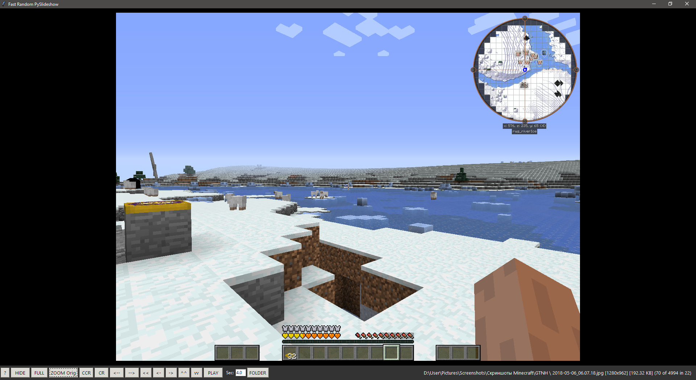

# Random Py Slideshow

Simple Python 3 slideshow tool for navigating massive image libraries. Made with Gemini. This program should work on Windows, Linux, and macOS.

The program processes hundreds of thousands of images in tens of thousands of folders on a standard hard drive within seconds. It starts displaying images immediately from a random folder while scanning the rest of the directory tree in the background. Supports random shuffle, folder navigation, and maintains a history of the last viewed images.

## Requirements
* Python 3.6+
* `pip install Pillow`

## Usage
Run the script in your image folder or pass the path as an argument:  
`python RandomSlideshow_v3.py "C:\Images"`

Either from the console or from a batch file, so you don’t have to worry about long paths and special characters.

`cd /usr/images
cd c:\images
python RandomSlideshow_v3.py -cwd`

### Hotkeys

| Key | Action |
| :--- | :--- |
| **F1** | Show Help |
| **Ctrl+S** | Switch between shuffle and sequential playback |
| **Alt+Enter** / **F11** | Toggle Fullscreen |
| **Esc** | Exit Fullscreen |
| **Space** | Play / Pause |
| **Arrows < >** | Previous / Next Random Image |
| **Arrow Up / Arrow Down** | Previous / Next File in Current Folder |
| PgUp / PgDn | Random file in the previous / next alphabetically sorted subfolder |
| **Home** | First File in Folder |
| **Z** | Toggle Zoom (Fit, Original, Fill) |
| **Shift** (hold) | 4× Loupe Zoom |
| **Ctrl+R / E** | Rotate Clockwise / Counter‑Clockwise |
| **I** | Toggle File Info |
| **Enter** | Open File Location |

---

# RU

# Случайное слайд‑шоу (Random Py Slideshow)

Простой инструмент на Python 3 для просмотра огромных коллекций изображений. Сделан с активным использованием Gemini. Эта программа должна работать на Windows, Linux и macOS

Программа за секунды обрабатывает сотни тысяч картинок в десятках тысяч папок на простом жёстком диске. Слайд‑шоу начинается сразу же со случайной папки, пока остальные файлы сканируются в фоне. Поддерживает случайный порядок, навигацию внутри папки и до закрытия программы хранит историю последних показанных изображений.

## Требования
* Python 3.6+
* `pip install Pillow`

## Запуск
Запустите скрипт в папке с изображениями или укажите путь аргументом:  
`python RandomSlideshow.py "C:\Images"`

или из консоли или коммандного файла, чтобы не заботиться о длинных путях и нестандартных символах:

`cd /usr/images
cd c:\images
python RandomSlideshow_v3.py -cwd`

### Горячие клавиши

| Клавиша | Действие |
| :--- | :--- |
| **F1** | Справка |
| **Ctrl+S** | Переключение между слуайным и последовательным показом |
| **Alt+Enter** / **F11** | На весь экран (переключение) |
| **Esc** | Выход из полноэкранного режима |
| **Пробел** | Пауза / Старт |
| **Стрелки < >** | Предыдущая / следующая случайная картинка |
| **Вверх / Вниз** | Предыдущий / следующий файл в текущей папке |
| **PgUp / PgDn** | Случайный файл в предыдущей / следующей по алфавиту подпапке |
| **Home** | Первый файл в папке |
| **Z** | Режим масштаба (Вписать, Оригинал, Заполнить) |
| **Shift** (удерживать) | Лупа ×4 |
| **Ctrl+R / E** | Вращение по / против часовой стрелки |
| **I** | Информация о файле (переключение) |
| **Enter** | Открыть папку с файлом |
